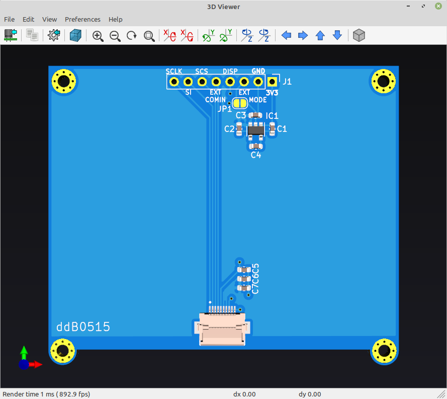
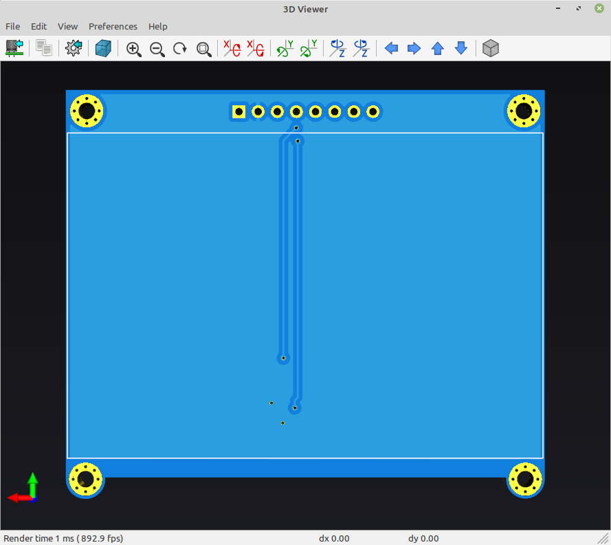

# LS027B7DH01-Breakout-board
LS027B7DH01 Breakout board

Inspiration from Adafruit breakout board without TTL and usage only of 3.3V (as is needed for my circuit) but can be adopted to use 5V

Using LTC1517-5 (as is suitable for battery power and low consumption)
Note: Instead 3.3uF you can use 4.7uF (tested)

# Interactive BOM
[Interactive BOM](http://htmlpreview.github.io/?https://raw.githubusercontent.com/ddB0515/LS027B7DH01-Breakout-board/main/hardware/bom/ibom.html)

](https://vimeo.com/493829613)

